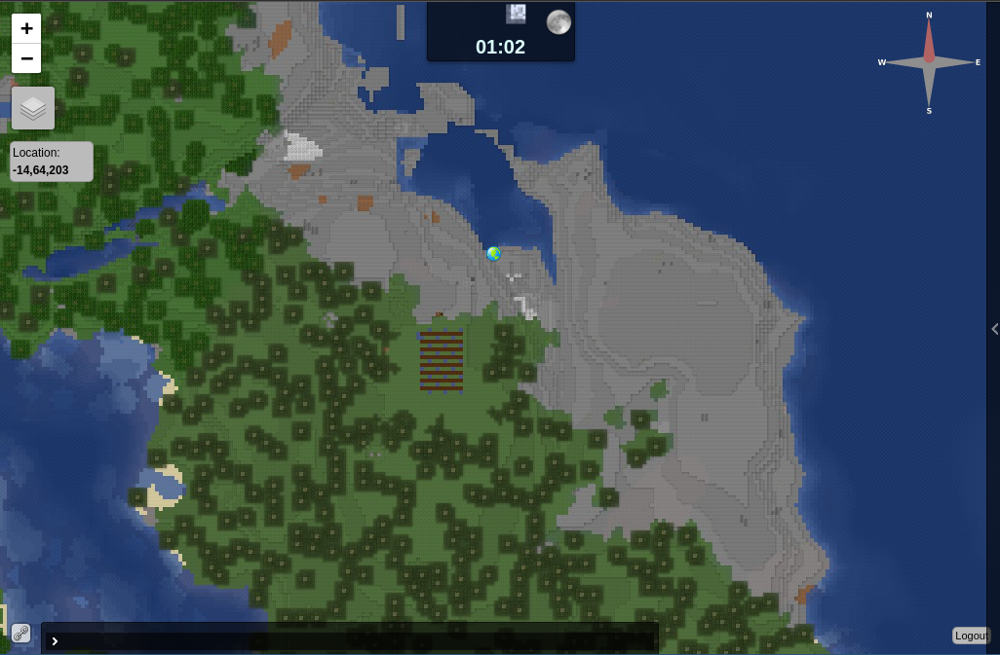

# Minecraft Server Java Edition

A quick and clean way to setup a minecraft java server using docker.

## Overview

Aims:

- minimal setup effort
- unrestricted potential (setup now, tweak later)
- incremental backups

## Getting Started

### Hardware and Operating System

This guide will assume you're running a debian-based server (eg: [ubuntu server](https://ubuntu.com/download/server)) that's always online.
However technically this will work on any OS that can run `docker` (and `python` for the initial setup)

### Install Docker & Python

```bash
sudo apt update
sudo apt install docker-ce python3 python3-pip
python3 -m pip install docker-compose
```

If you want to automate initialisation, you'll also need
some python libraries.

```bash
python3 -m pip install -r scripts/requirements.txt
```

### Generate Config Files

Before we start the server, you'll need to create a few setup files.

```bash
./mc init
```

This will ask you a few questions, but will randomise everything if you don't provide answers.

Note: randomising a password may be a good idea, since it will be harder to guess.

Also note: if you don't intend on using `https` for dynmap, you can ignore the questions for `init-letsencrypt.sh` and `nginx.conf`.
Or, if you do, but want to set it up later, you can always re-run `init`.

### Start Server

```bash
./mc start
```

This will take a while the first time, because it needs to

1. download docker image(s)
1. minecraft server,
1. plugins.

Progress of step 1 will be visible, but everything running inside the container will not.

To see the server's running comentary of what it's doing (or possibly how it failed), observe the logs with:

```bash
./mc logs
```

Then press `[Ctrl]+[C]` to stop viewing the logs.

### Join Server

From your minecraft client, connect to your server.

Note: to demonstrate, I'm connecting to my local machine (127.0.0.1),
but ideally you would put your domain, or static WAN IP here.

 

 

 


If you're watching the server logs, you should see your joining the game acknowledged with:

```
ds-java_1         | [06:57:59 INFO]: UUID of player FraggyMuffin is 067b17c6-661a-4451-bde3-9722c8afbc3a
ds-java_1         | [06:57:59 INFO]: FraggyMuffin joined the game
ds-java_1         | [06:57:59 INFO]: FraggyMuffin[/172.25.0.1:54406] logged in with entity id 191 at ([world]-319.6642708784545, 80.0, 318.05661385317035)
ds-java_1         | [07:14:18 INFO]: FraggyMuffin issued server command: /co i
```

Note: the server is completely open by default, allowing anyone can join. We'll fix this in the next step.

### Make Yourself an `op`

Only an `op` can grant permissions, and there is no `op`... to get around this you can run a command on the server directly using RCON.

Using RCON we'll do the following

- Add you as an `op`
- Enable `whitelist`
- Add you to the `whitelist` (technically not necessary, because you're an `op`, but it feels like the right thing to do)

```bash
./mc rcon
Using config file: /root/.rcon-cli.env
> op FraggyMuffin
Made FraggyMuffin a server operator
> whitelist on
Whitelist is now turned on
> whitelist add FraggyMuffin
Added FraggyMuffin to the whitelist
> 
```

Press `[Ctrl]+[D]` to exit the RCON-CLI. This is likely the only time you'll need to access RCON in this way. All future commands can be done inside minecraft itself.

## Dynmap

The [dynmap](https://github.com/webbukkit/dynmap) plugin provides a live view of the world, and players in it.

Once minecraft is running, you can view it on port `8123`: http://localhost:8123



### Public HTTPS

To access `dynmap` remotely, it's highly recommended you enable login support by setting the following `true` in `data/plugins/dynmap/configuration.txt`

```yaml
# Enable login support
login-enabled: true
# Require login to access website (requires login-enabled: true)
login-required: true
```

And using the reverse-proxy configured in the `nginx` docker-compose service.

Pre-requisites:

- You have control over the host running on the domain
- The host has ports 443, and 80 exposed (80 required for initial certification... it's a long story)

If you don't own a small part of the internet (eg: an AWS EC2 instance, and root domain), don't worry. You can achieve this with a dynamic DNS (I use [`duckdns.org`](https://www.duckdns.org)), allowing you to "own" (for free) a domain like `made-up-name.duckdns.org` which can point to your house, even if your ISP doesn't provide you a static IP 👍.

Once you're ready, initialise with:

```bash
bash init-letsencrypt.sh
```

If all of this confuses you, that's normal 😵‍💫.\
To learn how this works, search for "reverse proxy with nginx and docker". I've used [`wmnnd/nginx-certbot`](https://github.com/wmnnd/nginx-certbot) as a boilerplate for this & other projects (it's brilliant).

## Backup

Backing up couldn't be simpler than:

```bash
./mc backup
```

The first time it's run, it will create a duplicate of the `./data` folder.

Each subsequent time it's run, it will only copy new, and changed files. Any files that have not chnaged since last backed up will be [hard linked](https://en.wikipedia.org/wiki/Hard_link) to the previous backup.


### Restoring a backup

If your world is somehow unrecoverable, and you would like to revert it to a previous day, simply:

- Stop the server (`./mc stop`)
- backup once more (`./mc backup`) [optional]
- delete the `./data` directory (don't be afraid)
- copy the `./backups/<folder>` to `./data`

to summarise: example restoring backup: `20230609_180237`:

```bash
$ ./mc stop
Stopping minecraft-ds-java_overviewer_1 ... done
Stopping minecraft-ds-java_ds-java_1    ... done
$ ./mc backup
...
$ rm -rf ./data
$ cp -r backups/20230609_180237 data
$ ./mc start
Starting minecraft-ds-java_overviewer_1 ... done
Starting minecraft-ds-java_ds-java_1    ... done
```

### External backup

The above backup is stored alongside the server by default. Therefore this won't protect against theft, fire, hdd-wide corruption, and more.

The best backup you can make is on a separate device, preferably in a different building.

The easiest way to do this would be to mount an external drive (capable of hard-linking), then symlink it to the `./backups` folder.

```bash
$ mv ./backups ./backups-sidelined
$ ln -s /media/<mountpoint> ./backups
$ ./mc backup
```

Then consider deleting `./backups-sidelined` in +1 month.

Note that copying `data-sidelined` to `/media/<mountpoint>` will likey take up a lot of space, as hard-linking is unlikely to directly translate to the remote filesystem.

If this dosn't suit your purposes, please ignore the `./mc backup` feature of this project, and seek your own backup solution (there's hundreds out there)

## Cron Jobs

Aim:

- Backup daily (clear out after 30 days)

When running `./mc init` in the previous section, a `tasks.cron` file will have been crated.

Now copy this to `/etc/cron.d/` to tell cron what to do and when.

```bash
sudo cp tasks.cron /etc/cron.d/minecraft.cron
sudo systemctl restart cron.service
```

## `mc` Script

The [`mc`](./mc) script (short for "Minecraft") is nothing special, it's mostly a collection of `docker-compose` calls to start, stop, and perform other operations.


```
$ ./mc --help
Usage: ./mc [--help] ACTION [parameters]

Host Setup:
    $ ./mc init             Initialise config files

Containers:
  Service Control:
    $ ./mc build [service]  Builds docker containers (optional)
    $ ./mc start [service]  Start services
    $ ./mc stop [service]   Stop services
    $ ./mc down             Stops and removes running containers

  Status & Logs:
    $ ./mc show             Shows running containers
    $ ./mc logs [service]   Display and follow logs

Tooling:
  RCON Commandline Interface:
    $ ./mc rcon             RCON interface to server (must be running)

  Cron tasks
    $ ./mc backup           Create incremental backup of server
```
